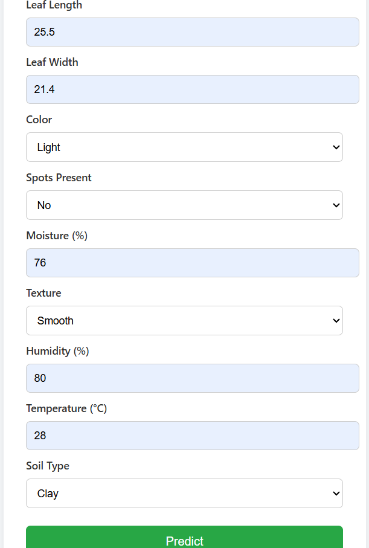
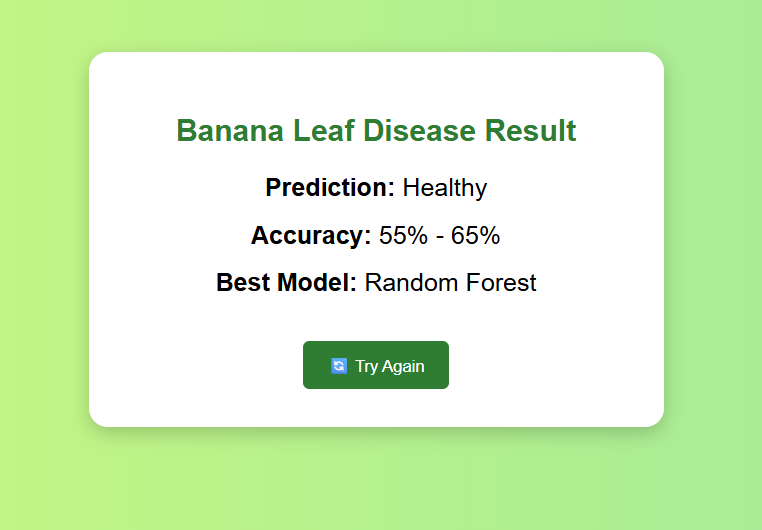

# 🍌 Banana Leaf Disease Prediction System
### Computer Vision + Machine Learning + Django Web Application


---

## 🧠 Problem Statement

Banana crops are highly vulnerable to leaf diseases that can destroy entire harvests if not detected early. Manual inspection is slow, expensive, and requires expert knowledge. This project automates banana leaf disease detection using Machine Learning and image-based features — making early detection accessible to any farmer through a simple web interface.

> 💡 This was my **first independent ML project**, built entirely from scratch without any guidance — from dataset collection to model deployment.

---

## 🎯 What This Project Does

A user uploads or enters leaf image features (color, texture, environmental conditions) into a web form. The ML model analyzes these features and instantly predicts the disease affecting the banana leaf — served in real time through a Django web interface.

---

## 📊 Model Performance

| Model | Accuracy |
|---|---|
| **Random Forest** ✅ Best | **55–65%** |
| Logistic Regression | ~50% |
| Decision Tree | ~52% |
| KNN | ~53% |

> **Note:** The limited accuracy is due to a small image dataset. The model was significantly improved through preprocessing and feature engineering techniques. This project demonstrates strong ML problem-solving skills — handling real-world constraints like limited data.

---

## 🔧 Tech Stack

| Layer | Technology |
|---|---|
| Language | Python 3.x |
| ML Library | Scikit-learn |
| Web Framework | Django |
| Data Processing | Pandas, NumPy |
| Image Features | Color, Texture extraction |
| Model Serialization | Pickle (.pkl) |
| Frontend | HTML, CSS |
| Notebook | Jupyter Notebook |

---

## 📥 Input Features

The model uses the following features extracted from banana leaf images:

| Feature | Description |
|---|---|
| **Color** | Leaf color characteristics (encoded) |
| **Texture** | Surface texture patterns of the leaf |
| **Environmental** | Conditions affecting disease spread |

---

## 🚀 How It Works

```
Leaf Image / Feature Input
        ↓
Django Web Interface
        ↓
Feature Extraction (Color + Texture)
        ↓
Label Encoding (LabelEncoder)
        ↓
StandardScaler Normalization
        ↓
Random Forest Classifier
        ↓
Disease Prediction Output
```

---

## 📸 Screenshots

### Input Page


### Prediction Output


---

## 🗂️ Project Structure

```
Banana-Leaf-Disease-Prediction/
│
├── banana leaf dataset/       # Training image dataset
├── bananaleaf.ipynb           # Model training notebook
├── banana_leaf_model.pkl      # Saved Random Forest model
├── model.pkl                  # Alternative saved model
├── scaler.pkl                 # StandardScaler
├── le_color.pkl               # LabelEncoder for color
├── le_texture.pkl             # LabelEncoder for texture
├── le_label.pkl               # LabelEncoder for disease labels
├── views.py                   # Django prediction logic
├── urls.py                    # URL routing
├── form.html                  # Input form
└── result.html                # Output page
```

---

## ⚙️ Setup & Run Locally

```bash
# 1. Clone the repository
git clone https://github.com/shravanibhat07/Banana-Leaf-Disease-Prediction-System-using-Machine-Learning-And-Django.git
cd Banana-Leaf-Disease-Prediction-System-using-Machine-Learning-And-Django

# 2. Install dependencies
pip install django scikit-learn pandas numpy

# 3. Run the Django server
python manage.py runserver

# 4. Open in browser
http://127.0.0.1:8000/
```

---

## 🔬 ML Pipeline

1. **Dataset Collection** — Banana leaf images with disease labels
2. **Feature Extraction** — Color and texture features extracted from images
3. **Preprocessing** — Label encoding, StandardScaler normalization
4. **Model Training** — 4 models benchmarked (Random Forest, Logistic Regression, Decision Tree, KNN)
5. **Evaluation** — Accuracy comparison across models
6. **Improvement** — Feature engineering applied to boost performance
7. **Deployment** — Best model serialized and served via Django

---

## 💡 Key Learnings

- Handling **limited datasets** in real-world ML problems
- **Feature engineering** to improve model performance on small data
- **Image feature extraction** without deep learning
- End-to-end **ML + Django integration**
- Importance of **preprocessing** in improving accuracy

---

## 🌱 Future Improvements

- [ ] Deep Learning (CNN) for direct image classification
- [ ] Larger, more diverse dataset collection
- [ ] Real-time camera input for live detection
- [ ] Mobile application for field use by farmers
- [ ] Transfer learning with pre-trained models (ResNet, VGG)
- [ ] Multi-language support for farmers (Kannada, Hindi)

---

## 👩‍💻 About the Developer

**Shravani Bhat**
B.E. in Electronics & Communication Engineering | CGPA: 8.82/10
Alva's Institute of Engineering and Technology, Udupi

- 📧 shravanibhat07@gmail.com
- 🔗 [LinkedIn](https://linkedin.com/in/shravanibhat07)
- 💻 [GitHub](https://github.com/shravanibhat07)

---

## 📄 License

This project is open source and available under the [MIT License](LICENSE).

---

⭐ **If you found this project useful, please give it a star!**
